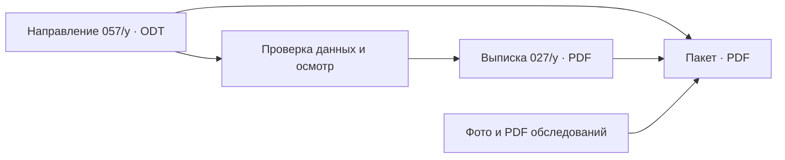

# МеДок

**От направления до готового пакета документов в одном PDF.**

Локальное приложение для врача-педиатра. Оно берёт направление 057/у, экспортированное из qMS в ODT, переносит реквизиты пациента в выписку 027/у и собирает пакет документов для передачи в другое учреждение. Врач дополняет и проверяет медицинский текст; программа занимается файлами и оформлением.

## Скачать

| Система | Готовая сборка |
| --- | --- |
| Windows 7 x64 | [MeDok-Windows7-x64.exe](https://github.com/madnessbrainsbl/MeDok/releases/latest/download/MeDok-Windows7-x64.exe) |
| «Альт Рабочая станция» 10 x64 | [MeDok-ALT10-x64.tar.gz](https://github.com/madnessbrainsbl/MeDok/releases/latest/download/MeDok-ALT10-x64.tar.gz) |

На Linux распакуйте архив и запустите `medok`. Для графического окна нужен X11 или Wayland. Чтобы включить ODT-направление в общий PDF, установите LibreOffice. Приложение не требует облачного аккаунта.

## Что делает

1. **Читает направление.** Переносит ФИО, дату рождения, полис и другие реквизиты из ODT в редактируемые поля.
2. **Готовит выписку.** Врач заполняет жалобы, анамнез, диагноз и осмотр, проверяет данные и сохраняет форму 027/у в PDF.
3. **Собирает пакет.** Располагает направление первым, выписку второй, обследования после них. Принимает фотографии и многостраничные PDF, подбирает качество итогового файла.
4. **Принимает снимки с телефона.** По QR-коду в локальной сети фотографии попадают в открытое приложение; их также можно добавить с диска.

Для повторных обращений есть карточка ребёнка. Данные нового пациента отделяются от предыдущего. Программа не ставит диагноз и не отправляет документы без действий врача.

## Как устроено



Интерфейс написан на Rust и `egui`. ODT разбирается локально, PDF выписки формируется через Typst. Для перевода направления в PDF при сборке пакета используется установленный LibreOffice. У Windows и Linux общие исходники, но отдельные сборки.

## Данные пациентов

Настройки, журнал и карточки программа хранит в `vypiska-данные` рядом с исполняемым файлом либо в каталоге настроек пользователя. Содержимое карточек защищено DPAPI в Windows и XChaCha20-Poly1305 в Linux. Имя файла карточки содержит СНИЛС, поэтому этот каталог нельзя публиковать или пересылать как обезличенный.

Приём фотографий по QR-коду включается отдельно и работает по HTTP в локальной сети. Для него нужна доверенная сеть или раздача телефона. Готовые PDF содержат данные пациентов и остаются на компьютере врача.

## Сборка из исходников

```powershell
cargo test --locked
cargo build --release
```

Для Windows 7 x64 используйте `pwsh -File сборка.ps1`: скрипт собирает цель `x86_64-win7-windows-msvc`, проверяет импорты PE и кладёт `MeDok.exe` рядом с `Cargo.toml`. Нужны nightly Rust и установленная цель Windows 7. Linux-версию для «Альт 10» собирайте внутри «Альт 10», чтобы не привязать бинарник к более новой `glibc`.

В `tests/fixtures` лежат только искусственные документы и изображения. Настоящие направления, печати, подписи, карточки и PDF пациентов в репозиторий не входят.

## Права

Условия использования показаны в окне «О программе». Публикация исходного кода сама по себе не предоставляет лицензию на изменение или распространение программы.
